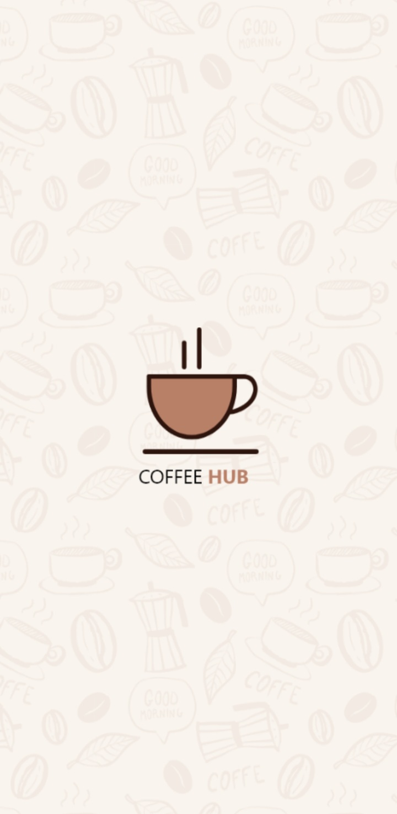
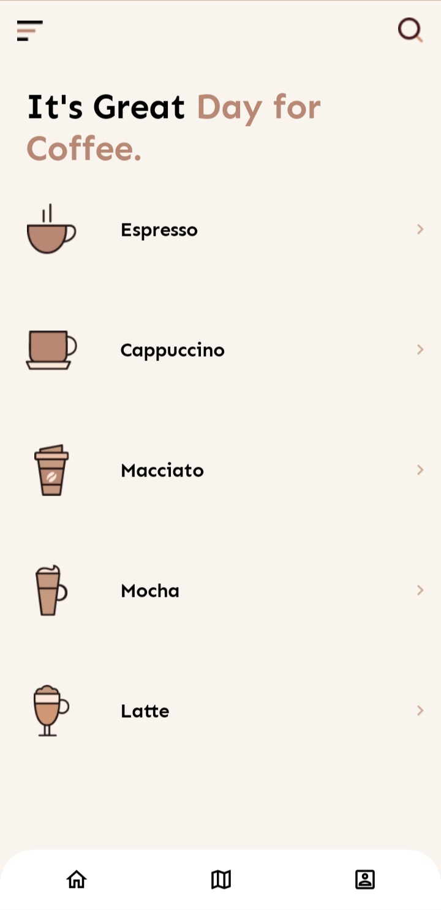
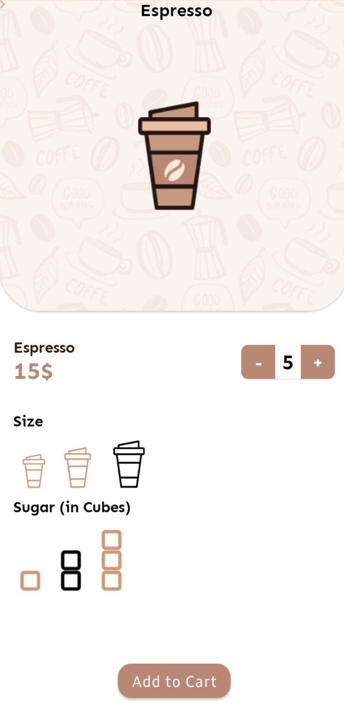

# Coffee Maker
Sample app, built with
[Jetpack Compose](https://developer.android.com/jetpack/compose).

~~Using the Canary version of `Android Studio 4.2 Canary 7` and the `0.1.0-dev15` jetpack libraries.~~
### Update 25/12/2020
Using the Canary version of `Android Studio Arctic Fox|2020.3.1 Canary 3` and the `1.0.0-alpha09` jetpack libraries.

Screenshots
-----------
  

## Features

This sample contains three screens: a splash screen, a list of coffee, and a page to
order a coffee.

### Screens
Package [`app.elite.coffeemaker.screen`][1]

The Package contains all the application screens.

See how to:

* Use `Row`s and `Column`s to arrange the contents of the UI
* Add an `AppBar`
* Add an `BottomAppBar`
* Add an `Image`
* Display `AlertDialog`
* Use `MaterialTypography` and opacity to style the text
* Use `Shape` to round the corners of the images
* Use elevation to make the `Card`s stand out from the background

[1]: app/src/main/java/app/elite/coffeemaker/screen

### Model
Package [`app.elite.coffeemaker.model`][2]

The Package contains all `Coffee` model.

See how to:

* Declare a Kotlin Model
* Using data class

[2]: app/src/main/java/app/elite/coffeemaker/model

### Navigation @Deprecated

The Package contains the navigation class using `ViewModel` and `SavedStateHandle`

See how to:

* Use `ViewModel` to navigate between screens
* Use `SavedStateHandle` to handle navigation stack


### New Navigation Using jetpack compose navigation
Package [`app.elite.coffeemaker.utils`][3]

Create a sealed class to hold the screens
```
sealed class Screen(val route: String) {
    object SplashScreen : Screen("splash")
    object Home : Screen("home")
    object Details : Screen("details")
}
```

Create a `NavController` by using the `rememberNavController()` inside the `MainActivity`
```
val navController = rememberNavController()
```

Finally create the `NavHost` using both the `NavController` and which screen to start with `startDestination`
```
NavHost(
    navController = navController,
    startDestination = Screen.SplashScreen.route
    ){
        composable(Screen.SplashScreen.route) { BaseComponent { SplashScreen(navController = navController) } }
        composable(Screen.Home.route) { BaseComponent { CoffeeListScreen(navController = navController) } }
        composable("${Screen.Details.route}/{id}") {
            BaseComponent {
            DetailsScreen(coffee = it.arguments?.getString("id", "1")?.toInt()!!)
        }
    }
}
```
[3]: app/src/main/java/app/elite/coffeemaker/utils

### Data

The data in the sample is static, held in the `app.elite.coffeemaker.model` package in the `Data` class.

### Coming Soon

* Adding more screen
* Adding Unit Test
* Adding Animation 
* and more

## License

```
Copyright 2020 The Android Open Source Project

Licensed to the Apache Software Foundation (ASF) under one or more contributor
license agreements. See the NOTICE file distributed with this work for
additional information regarding copyright ownership. The ASF licenses this
file to you under the Apache License, Version 2.0 (the "License"); you may not
use this file except in compliance with the License. You may obtain a copy of
the License at

http://www.apache.org/licenses/LICENSE-2.0

Unless required by applicable law or agreed to in writing, software
distributed under the License is distributed on an "AS IS" BASIS, WITHOUT
WARRANTIES OR CONDITIONS OF ANY KIND, either express or implied. See the
License for the specific language governing permissions and limitations under
the License.
```
